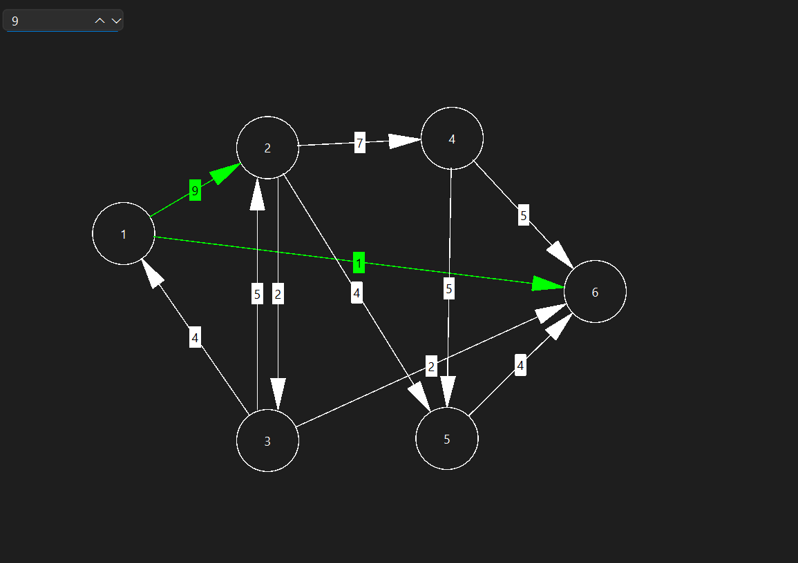
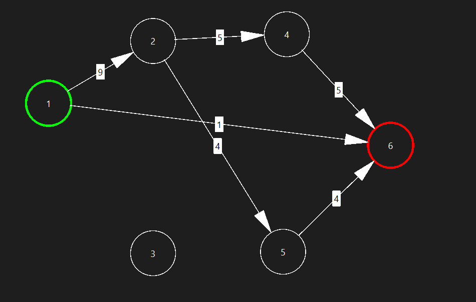

# Ford-Fulkerson Algorithm - Maximum Flow and Minimum Cut Implementation

This repository contains an implementation of the **Ford-Fulkerson Algorithm**, which is used to compute the maximum flow and minimum cut in a flow network. Users can create, modify, and visualize graphs interactively.

## Overview
The **Ford-Fulkerson Algorithm** is an approach to solve the Maximum Flow problem in a directed graph where each edge has a capacity. The algorithm repeatedly finds augmenting paths in the residual graph and increases the flow along these paths until no more augmenting paths exist.

## Features
- **Interactive Graph Editing**
  - Add and remove **nodes** by clicking on the canvas.
  - Create **edges** by selecting two nodes and assigning weights.
  - Drag nodes to reposition them.

- **Ford-Fulkerson Algorithm visualizer**
  - Implementation of **Ford-Fulkerson Algorithm** using Depth First Search (DFS)
  - Handles directed graphs with capacities
  - Computes and displays the maximum possible flow from source to sink

## Prerequisites

- **Qt Creator installed**